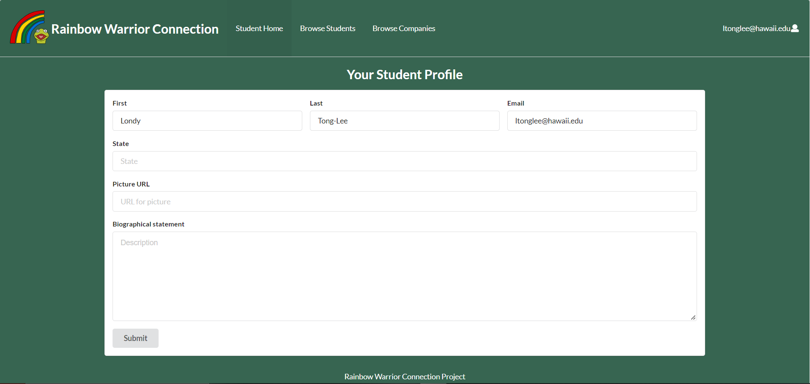
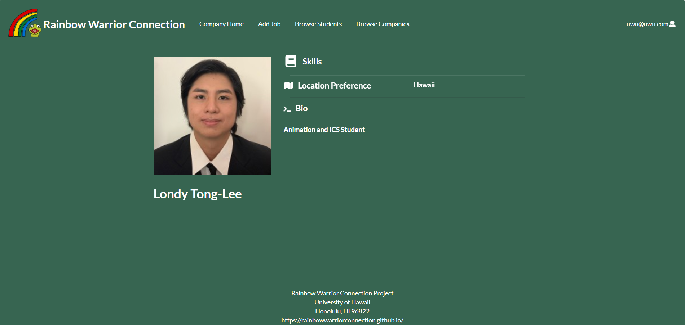
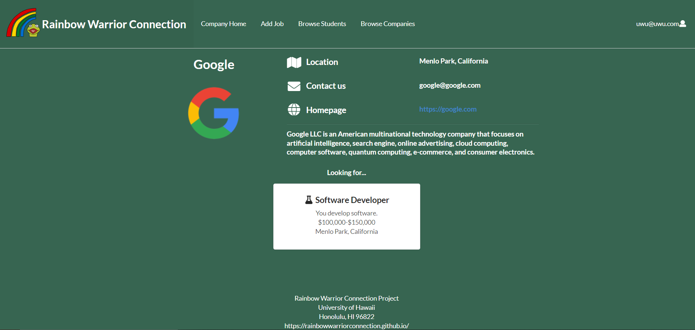
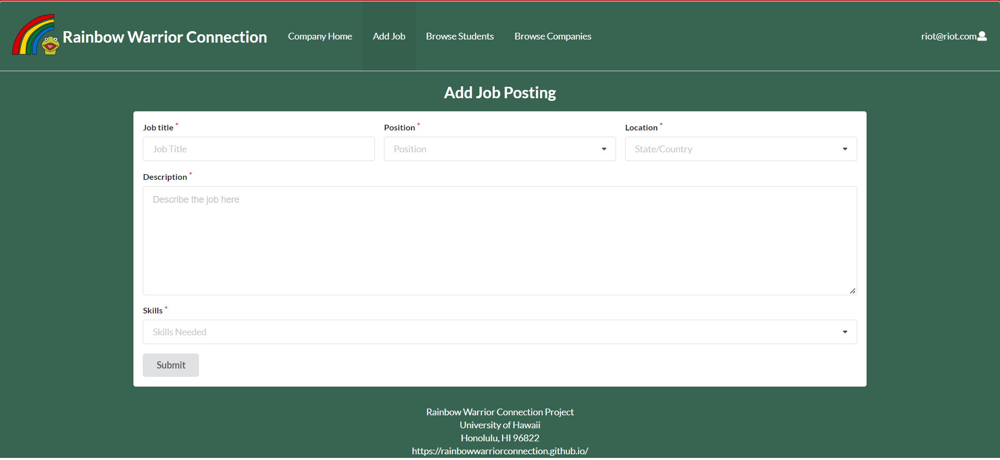

## Rainbow Warrior Connection

* [Overview](#Overview)
* [User Guide](#User Guide)
* [Important Links](#Important Links)

## Deployment
- [Rainbow Warrior Connection Website](http://159.89.232.121/#/)

## Overview

Rainbow Warrior Connection is an application where UH students can post their skills online and look for jobs in the industry they want to work for. 
While companies can post their job listings, hiring positions, location, salary, etc. so students can see what they are signing up for. For this application,
we are looking to provide access to companies and students with their own separate pages. Students will be able to browse and filter out jobs while companies can
update their listings. 

## User Guide

### Landing Page

The first time you arrive to Rainbow Warrior Connection, you will be welcomed by our homepage, describing what our website does.


### Register Your Account

If you are new student to this website, select the "Login" icon and click on "signup". If you are are a company, select "Company Sign Up" instead.

#### Student Signup


#### Company Signup


### Student Home Page

If you are a student user, you can edit your profile picture, set your location in the United States and make a profile bio to put yourself out there to companies.



### Student Browsing Page

For students, you can browse companies and see what they are about and what jobs they are offering. Keep an eye out for new jobs as companies will update them constantly.


### Student Profile Page

After you click on a student's card, it takes you to the Student Profile page. The page displays information about the student and shows a picture of them.



### Company Home Page

When you login, you will be greeted with a form to fill out your company's information and contact information. 


### Company Profile Page

Clicking on a company's card bring you to their Company Profile page, displaying basic information about the company as well as their job listings.



### Create a Job Listing

As a company, you can create job listings so students can see what jobs you are looking for. You can choose between internship, part-time, and full-time. Fill out your location and describe what you are looking for to fill the position. 




## Developer Guide

For developers who want to update or improve Rainbow Warrior Connection, visit our [Rainbow Warrior Connection](https://github.com/rainbowwarriorconnection/rainbowwarriorconnection) on github. You want to first download our repository to your github. 


Third, go into your app directory by using:

For Windows:
```
cd app
```
For Macs:
```
$ cd app
```

Run meteor by using:

For Windows:

```
meteor npm install
```
For Macs:
```
$ meteor npm install
```

## Running the system

Once the libraries are installed, you can run the application by invoking the "start" script in the package.json file.

For Windows:

```
meteor npm run start
```
For Macs:
```
$ meteor npm run start
```

### Application Design
Rainbow Warrior Connection is based off of [Bowfolios](github.com/bowfolios) and [meteor-example-form-react](https://ics-software-engineering.github.io/meteor-example-form-react/). Watch the videos and documentation for groundwork reference of application design and form processing.  
  
## Reviews

### MB Technologies
Web links and interfaces are not working smoothly. Browse students interface is now working and stuck on the login to your account. Add job tab cannot submit does not input to database. Browse Companies interface looks nice and seems to work well. Company Home fills in submitted works but does not clear after submission.

Overall the web site does not have instructions or description on the purpose of the site. Site could use a FAQ page for instructions or answers. Graphics seem nice and interface layout is decent. The main page logo graphic is a bit too big for the page and should be smaller..  Website still needs a lot of work to be considered usable.  
  
### Clara
- A lot of emphasis on Kermit, makes it look like a mascot 
- Picture url is a little troublesome, uploading files of picture can be an improvement 
- Have a different texture on the side of browse students/ companies
- Have a filter for browse companies

### Justin
- Interests in alphabetical order 
- The website is easy and simple
- Doesn't look professional/ interesting
- Can include more things to filter by (experience, other things)  

### V (Name kept anonymous)
- They layout is organized and is easy to navigate.
- Everything is on the website for a purpose. No unnecessary bells and whistles. Straightforward website.
- Color choice is pleasing to the eye.  

### B (Name kept anonymous)
- Browse pages look too empty
- Website looks straightforward/ not complicated
- Big whitespace on bottom of some pages looks bad

## Thank you for the feedback 
We will use this to improve on the website and we appreciate the time you have taken to try our website out. From these reviews, it seems like we need to fix some links and better improve some page ui. Another main issue is to make it easier to upload photos. 
## Important Links
- [Rainbow Warrior Connection GitHub](https://github.com/rainbowwarriorconnection)
- [Rainbow Warrior Connection Team Contract](https://docs.google.com/document/d/15uPSs6yrsvvbDGVCjfiiWuhTohnyuAZWgvVWET1-S08/edit?usp=sharing)
- [Project Milestone 1](https://github.com/rainbowwarriorconnection/rainbowwarriorconnection/projects/1)
- [Project Milestone 2](https://github.com/rainbowwarriorconnection/rainbowwarriorconnection/projects/2)
- [Project Milestone 3](https://github.com/rainbowwarriorconnection/rainbowwarriorconnection/projects/3)


