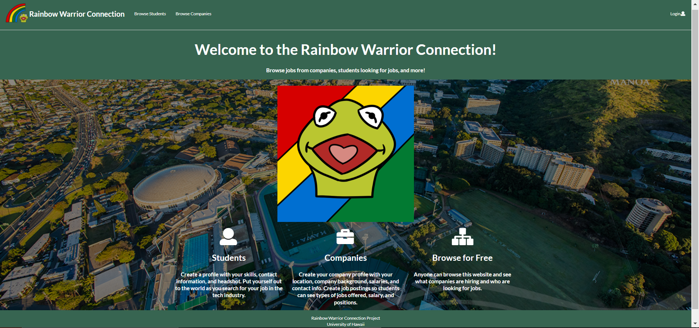
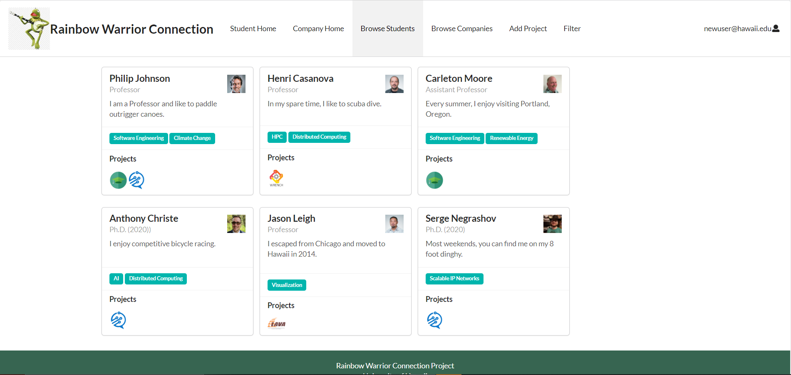
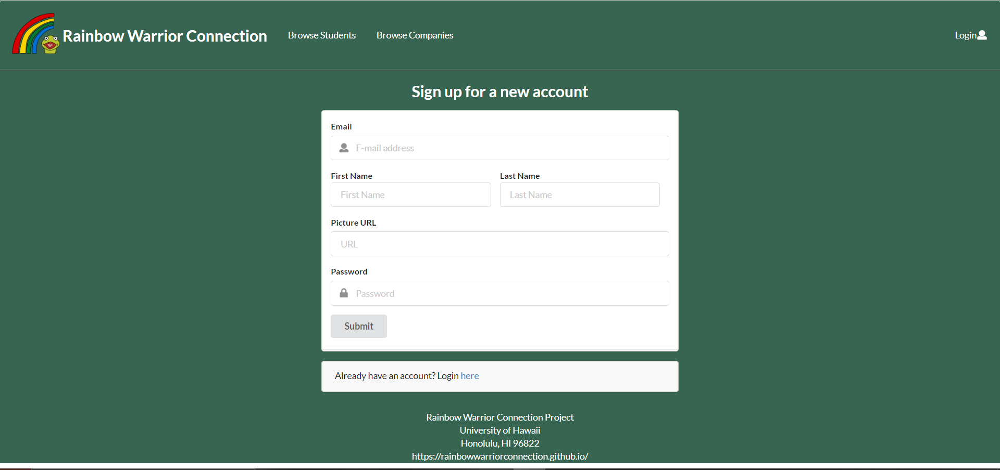

## Rainbow Warrior Connection

* [Overview](#Overview)
* [Deployment](#Layout)
* [Important Links](#Important Links)

## Overview

Rainbow Warrior Connection is an application where UH students can post their skills online and look for jobs in the industry they want to work for. 
While companies can post their job listings, hiring positions, location, salary, etc. so students can see what they are signing up for. For this application,
we are looking to provide access to companies and students with their own separate pages. Students will be able to browse and filter out jobs while companies can
update their listings. 

## Layout

### Landing Page

The Landing page provides information about the website and allows users to sign in to their existing account or create a new one.

### Browsing Page

Clicking on the Browse button brings you to the browsing page. Here, users can input specific information in order to filter out either student or company cards.

### Sign in/ Sign up

Users are able to sign in using their existing account information or create a new one.

### Student Home Page

On the Student Home page, there is a form that holds the information about the student. The user can edit their profile and it will update their profile with the new information.

### Student Profile Page

After you click on a student's card, it takes you to the Student Profile page. The page displays information about the student and shows a picture of them.

### Company Home Page

Similarly to the Student Home page, the Company Home page holds information about the company or organization. The company can edit their location, company description, company logo, and add, edit, or delete job listings.

### Company Profile Page

Clicking on a company's card bring you to their Company Profile page, displaying basic information about the company as well as their job listings.

### Administrator Home page

Administrators have a different home page in comparison to the company and student home pages. They are able to add or delete from collections such as different skills and geographic locations. Admins are also able to delete accounts that are not appropriate.

## Important Links

- [Rainbow Warrior Connection GitHub](https://github.com/rainbowwarriorconnection)
- [Rainbow Warrior Connection Team Contract](https://docs.google.com/document/d/15uPSs6yrsvvbDGVCjfiiWuhTohnyuAZWgvVWET1-S08/edit?usp=sharing)
- [Project Milestone 1](https://github.com/rainbowwarriorconnection/rainbowwarriorconnection/projects/1)